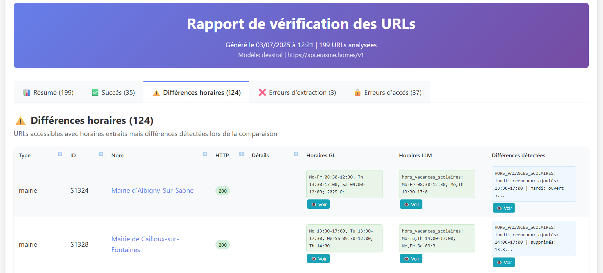
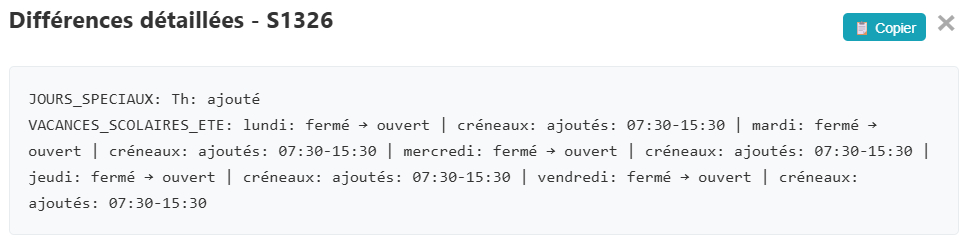

<div align="center">
  
</div>

# SmartWatch : extracteur d'horaires intelligent

**SmartWatch** est un pipeline d'extraction de données conçu pour extraire, analyser, et comparer les horaires d'ouverture de divers établissements publics (mairies, piscines, médiathèques) à partir de leurs sites web. Il utilise des modèles de langage pour interpréter le contenu et comparer les horaires d'ouverture extraits à des données de référence, puis génère et envoie par mail des rapports HTML interactifs pour visualiser les résultats.

##  Documentation

La documentation complète est accessible sur [https://datagora-erasme.github.io/smart_watch/](https://datagora-erasme.github.io/smart_watch/)

## ✨ Fonctionnalités

*   **Collecte de données** : charge les URLs des établissements à analyser depuis un fichier CSV.
*   **Conversion des données** : converti les pages web en Markdown et nettoie ce dernier pour ne garder que l'essentiel
*   **Filtrage de contenu intelligent** : utilise des embeddings (via `nomic-embed`) pour identifier et extraire uniquement les sections de page web relatives aux horaires, optimisant ainsi les appels aux LLM.
*   **Extraction par LLM** : interroge des LLM (compatibles OpenAI ou Mistral) pour extraire les horaires dans un format structuré customisé (JSON).
*   **Comparaison automatisée** : compare les horaires extraits par le LLM avec des données de référence (depuis data.grandlyon.com) pour détecter les divergences.
*   **Rapports détaillés** : génère des rapports HTML interactifs, permettant de visualiser les statistiques globales, les statuts de traitement, et les détails de chaque URL.
*   **Orchestration** : un pipeline assure une exécution séquentielle et contrôlée.
*   **Conteneurisation** : prêt à l'emploi avec Docker et Docker Compose pour un déploiement simplifié.

## Capture d'écran
### Aperçu du rapport
<div align="center">
  
</div>

### Fenêtre modale des différences détectées
<div align="center">
  
</div>

## Diagramme de fonctionnement
```
[ main.py ] (Orchestrateur du pipeline)
     │
     ├─> 1. Initialise [ core.ConfigManager ] (Charge la configuration depuis .env)
     │         └─> Agrège [ config.* ] (LLMConfig, DatabaseConfig, etc.)
     │
     ├─> 2. Initialise les processeurs principaux avec la configuration
     │
     └─> 3. Exécute le pipeline séquentiel :
         │
         ├─> [1] SETUP : [ utils.CSVToPolars ] -> [ processing.DatabaseManager ]
         │     (Charge les URLs depuis le CSV et prépare une nouvelle exécution en base)
         │
         ├─> [2] FETCH : [ processing.URLProcessor ]
         │     (Récupère le contenu des URLs)
         │     └─> Utilise [ utils.HtmlToMarkdown ] pour la conversion
         │
         ├─> [3] CLEAN : [ utils.MarkdownCleaner ]
         │     (Nettoie le Markdown brut)
         │
         ├─> [4] FILTER : [ core.MarkdownProcessor ]
         │     (Filtre sémantiquement le Markdown pour ne garder que les sections pertinentes)
         │     └─> Utilise [ core.LLMClient ] pour les embeddings
         │
         ├─> [5] EXTRACT : [ processing.LLMProcessor ]
         │     (Extrait les horaires du Markdown filtré au format JSON)
         │     ├─> Utilise [ core.LLMClient ] pour l'appel au LLM
         │     └─> Utilise [ utils.CustomJsonToOSM ] pour convertir le JSON en format OSM
         │
         ├─> [6] COMPARE : [ processing.ComparisonProcessor ]
         │     (Compare les horaires extraits (OSM) avec les données de référence)
         │     └─> Utilise [ core.ComparateurHoraires ] pour la logique de comparaison
         │
         └─> [7] REPORT : [ reporting.ReportManager ]
               (Génère et envoie le rapport final)
               ├─> Utilise [ reporting.GenererRapportHTML ] pour créer le fichier HTML
               └─> Utilise [ core.EmailSender ] pour envoyer l'email avec pièces jointes

-----------------------------------------------------------------------------------------
Modules Transversaux :
-----------------------------------------------------------------------------------------
  - [ core.Logger ] : utilisé par tous les modules pour la journalisation.
  - [ core.ErrorHandler ] : utilisé pour une gestion centralisée des erreurs.
  - [ processing.DatabaseManager ] : utilisé par toutes les étapes du pipeline pour lire et écrire les résultats dans la base de données SQLite.

-----------------------------------------------------------------------------------------
Modèles de rapports et des structures de données
-----------------------------------------------------------------------------------------
  - [ data_models.schema_bdd ] : définit la structure de la base de données pour SQLAlchemy.
  - [ data_models.opening_hours_schema.json ] : modèle JSON décrivant des horaires d'ouverture
  - [ assets.templates.ReportTemplate.html ] : modèle html pour le rapport envoyé en pièce jointe du mail
  - [ assets.templates.SimpleReportTemplate.html ] : modèle html pour le corps du mail

  ```

## Fiabilité des informations

L'extraction des horaires d'ouverture depuis les pages web (via un Markdown nettoyé et filtré) est soumise au fonctionnement du LLM choisi. L'utilisation d'un modèle destiné au développement (comme `devstral`) est préférable à un modèle généraliste ou plus "littéraire" (tel que `gemma3`).

Le modèle JSON sera automatiquement passé en argument du prompt et assure normalement une sortie structurée et reproductible. Ce modèle est passé en argument au LLM, en tant que `response_format` pour les modèles compatibles OpenAI, et en tant que `tool_params` pour les modèles Mistral via API (cf `processing.llm_processor.py`).

## 🚀 Installation

1.  **Clonez le dépôt :**
    ```sh
    git clone [https://github.com/datagora-erasme/smart_watch](https://github.com/datagora-erasme/smart_watch)
    cd smart_watch
    ```

2.  **Créez un environnement virtuel et activez-le :**
    ```sh
    python -m venv .venv
    source .venv/bin/activate  # Sur Windows: .venv\Scripts\activate
    ```

3.  **Installez les dépendances :**
    ```sh
    pip install -r requirements.txt
    ```

## ⚙️ Configuration

1.  Créez un fichier `.env` à la racine du projet en vous basant sur le modèle [`env.model`](.env.model).
2.  Configurez les variables d'environnement requises :
    *   `CSV_URL_HORAIRES`: l'URL ou le chemin local du fichier CSV contenant les lieux à analyser.
    *   **Configuration LLM** : renseignez les URL, clés API et le modèle pour le fournisseur de votre choix (OpenAI, Mistral, etc.).
    *   **Configuration Email** : paramétrez les emails et informations SMTP pour l'envoi des rapports.

## ▶️ Utilisation

Pour lancer le pipeline complet, exécutez le script principal :

```sh
python main.py
```

Le programme effectuera les actions suivantes :
1.  initialisera la base de données SQLite (`data/SmartWatch.db`).
2.  traitera chaque URL, filtrera le contenu, et extraiera les horaires via le LLM.
3.  comparera les résultats et stockera tout en base de données.
4.  enverra un rapport et les logs par mail.
5.  écrira les logs dans `logs/SmartWatch.log`.

## 🐳 Utilisation avec Docker

Vous pouvez également lancer l'application dans un conteneur Docker.

1.  **Construisez l'image :**
    ```sh
    docker build -t smartwatch .
    ```

2.  **Exécutez le conteneur :**
    Assurez-vous que votre fichier `.env` est présent à la racine.
    ```sh
    docker run --env-file .env -v $(pwd)/data:/app/data -v $(pwd)/logs:/app/logs smartwatch
    ```
    Les rapports et la base de données seront générés dans les dossiers `data` et `logs` de votre machine hôte.

## 📄 Licence

Ce projet est sous licence GNU General Public License v3.0. Voir le fichier [LICENCE](LICENCE)
