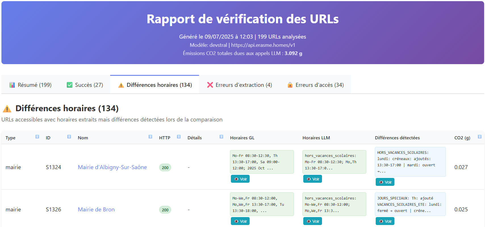
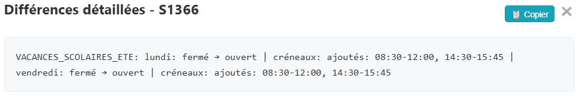

<div align="center">
  
  
  <!-- Badges informatifs -->
  [](https://www.python.org/)
  [](LICENCE)
  [](https://github.com/astral-sh/ruff)
  [](https://github.com/astral-sh/uv)
  
  [](https://codecarbon.io/)
  [](https://www.docker.com/)
  [](https://www.sphinx-doc.org/)
  
  <!-- Liens de navigation -->
  <p>
    <a href="https://github.com/datagora-erasme/smart_watch">Home</a> •
    <a href="https://datagora-erasme.github.io/smart_watch/">Documentation</a> •
    <a href="https://erasme.org/">Erasme</a> •
    <a href="https://www.grandlyon.com/">Métropole de Lyon</a> •
    <a href="https://data.grandlyon.com/">Data Grand Lyon</a>
  </p>
</div>

# SmartWatch : extracteur d'horaires intelligent

**SmartWatch** est un pipeline d'extraction de données conçu pour extraire, analyser, et comparer les horaires d'ouverture de divers établissements publics de la Métropole de Lyon (mairies, piscines, médiathèques), à partir de leurs sites web. Il utilise des modèles de langage pour interpréter le contenu et comparer les horaires d'ouverture extraits à des données de référence (issues de data.grandlyon.com), puis génère et envoie par mail des rapports HTML interactifs pour visualiser les résultats.

## Fonctionnalités

*   **Collecte de données** : charge les URLs des établissements à analyser depuis un fichier CSV.
*   **Conversion des données** : converti les pages web en Markdown et nettoie ce dernier pour ne garder que l'essentiel
*   **Filtrage de contenu intelligent** : utilise des embeddings (via `jina-embeddings-v3`) pour identifier et extraire uniquement les sections de page web relatives aux horaires, optimisant ainsi les appels aux LLM.
*   **Extraction par LLM** : interroge des LLM (compatibles OpenAI ou Mistral) pour extraire les horaires dans un format structuré customisé (JSON).
*   **Suivi de la consommation carbone** : mesure les émissions de CO2 des appels aux LLM (extraction et embeddings) grâce à `codecarbon` et les affiche dans les rapports.
*   **Comparaison automatisée** : compare les horaires extraits par le LLM avec des données de référence (depuis data.grandlyon.com) pour détecter les divergences.
*   **Rapports détaillés** : génère des rapports HTML interactifs, permettant de visualiser les statistiques globales, les statuts de traitement, et les détails de chaque URL.
*   **Orchestration** : un pipeline assure une exécution séquentielle et contrôlée.
*   **Conteneurisation** : prêt à l'emploi avec Docker et Docker Compose pour un déploiement simplifié.

## Capture d'écran
### Aperçu du rapport
<div align="center">
  
</div>

### Fenêtre modale des différences détectées
<div align="center">
  
</div>

## Architecture
### Diagramme de fonctionnement
```
[ main.py ] (Orchestrateur)
  │
  ├─> A. Charge la configuration [ core.ConfigManager ] (depuis .env)
  │         └─> Agrège [ config.* ] (LLMConfig, DatabaseConfig, etc.)
  │
  ├─> B. Instancie les processeurs principaux avec la configuration
  │
  └─> C. Exécute séquentiellement le pipeline :
        │
        ├─> [1] Création : [ processing.DatabaseProcessor ]
        │     (Créé la base de données et les tables nécessaires)
        |
        ├─> [2] Initialisation : [ utils.CSVToPolars ] -> [ processing.SetupProcessor ]
        │     (Charge les URLs depuis le CSV et prépare une nouvelle exécution)
        │
        ├─> [3] Extraction URL : [ processing.URLProcessor ]
        │     (Récupère le contenu des URLs)
        │     └─> Utilise [ utils.HtmlToMarkdown ] pour la conversion
        │
        ├─> [4] Nettoyage : [ utils.MarkdownCleaner ]
        │     (Nettoie le Markdown brut)
        │
        ├─> [5] Filtrage : [ core.MarkdownProcessor ]
        │     (Filtre le Markdown sémantiquement par embeddings, pour ne garder que les sections pertinentes)
        │     └─> Utilise [ core.LLMClient ] pour les embeddings
        │
        ├─> [6] Extraction LLM : [ processing.LLMProcessor ]
        │     (Extrait par LLM et au format JSON les horaires du Markdown filtré)
        │     ├─> Utilise [ core.LLMClient ] pour l'appel au LLM
        │     └─> Utilise [ utils.CustomJsonToOSM ] pour convertir le JSON en format OSM
        │
        ├─> [7] Comparaison : [ processing.ComparisonProcessor ]
        │     (Compare les horaires extraits (OSM) avec les données de référence issues de data.grandlyon.com)
        │     └─> Utilise [ core.ComparateurHoraires ] pour la logique de comparaison
        │
        └─> [8] Rapport : [ reporting.ReportManager ]
              (Génère et envoie le rapport final)
              ├─> Utilise [ reporting.GenererRapportHTML ] pour créer le fichier HTML
              └─> Utilise [ core.EmailSender ] pour envoyer l'email avec pièces jointes
```
### Modules Transversaux
```
- [ core.Logger ] : utilisé par tous les modules pour la journalisation.
- [ core.ErrorHandler ] : utilisé pour une gestion centralisée des erreurs.
- [ core.DatabaseManager ] : utilisé pour lire et écrire les résultats dans la base de données SQLite.
- [ codecarbon ] : mesure les émissions de CO2 des appels aux LLM.
```
### Modèles de rapports et des structures de données
```
- [ data_models.schema_bdd ] : définit la structure de la base de données pour SQLAlchemy.
- [ data_models.opening_hours_schema.json ] : modèle JSON spécifique décrivant des horaires d'ouverture.
- [ assets.templates.ReportTemplate.html ] : modèle html pour le rapport envoyé en pièce jointe du mail.
- [ assets.templates.SimpleReportTemplate.html ] : modèle html pour le corps du mail.
```

## Fiabilité des informations

L'extraction des horaires d'ouverture depuis les pages web (via un Markdown nettoyé et filtré) est soumise au fonctionnement du LLM choisi.

Le modèle JSON sera automatiquement passé en argument du prompt et assure normalement une sortie structurée et reproductible. Ce modèle est passé en argument au LLM, en tant que `response_format` pour les modèles compatibles OpenAI, et en tant que `tool_params` pour les modèles Mistral via API (cf `processing.llm_processor.py`).

## Installation

1.  **Clonez le dépôt :**
    ```sh
    git clone https://github.com/datagora-erasme/smart_watch
    cd smart_watch
    ```

2.  **Créez un environnement virtuel et installez les dépendances :**

    *   **Avec `pip` (méthode classique) :**
        ```sh
        # Créez et activez l'environnement virtuel
        python -m venv .venv
        source .venv/bin/activate  # Sur Windows: .venv\Scripts\activate

        # Installez les dépendances
        pip install -r requirements.txt
        ```

    *   **Avec `uv` (méthode recommandée, plus rapide) :**
        ```sh
        # Créez, activez et installez les dépendances en une seule commande
        uv sync
        ```
        Pour activer l'environnement par la suite : `source .venv/bin/activate` (ou `.venv\Scripts\activate` sur Windows).

3.  **Installez les navigateurs Playwright :**
    ```sh
    python -m playwright install
    ```
    Sur Linux, si des dépendances système sont manquantes, exécutez d'abord :
    ```sh
    python -m playwright install-deps
    ```
    Sur Windows, la commande `install` suffit généralement.

## Configuration

1.  Créez un fichier `.env` à la racine du projet en vous basant sur le modèle [`env.model`](.env.model).
2.  Configurez les variables d'environnement requises :
    *   `CSV_URL_HORAIRES`: l'URL ou le chemin local du fichier CSV contenant les lieux à analyser.
    *   **Configuration LLM** : renseignez les URL, clés API et le modèle pour le fournisseur de votre choix (OpenAI, Mistral, etc.).
    *   **Configuration Email** : paramétrez les emails et informations SMTP pour l'envoi des rapports.

## Utilisation

Pour lancer le pipeline complet, exécutez le script principal :

```sh
python main.py
```

Le programme effectuera les actions suivantes :
1.  initialisera la base de données SQLite (`data/SmartWatch.db`).
2.  traitera chaque URL, filtrera le contenu, et extraiera les horaires via le LLM.
3.  comparera les résultats et stockera tout en base de données.
4.  enverra un rapport et les logs par mail.
5.  écrira les logs dans `logs/SmartWatch.log`.

## Utilisation avec Docker

Pour lancer l'application avec Docker, la méthode recommandée est d'utiliser `docker-compose`, qui simplifie la gestion du conteneur et des variables d'environnement.

1.  **Assurez-vous que votre fichier `.env` est présent** à la racine du projet.

2.  **Construisez l'image et lancez le conteneur avec `docker-compose` :**
    ```sh
    docker-compose up --build
    ```
    Cette commande va :
    - Construire l'image Docker en se basant sur le `Dockerfile`.
    - Créer et démarrer le conteneur.
    - Charger automatiquement les variables d'environnement depuis le fichier `.env`.

    Les rapports et la base de données seront générés dans les dossiers `data` et `logs` de votre machine hôte.

## Contribuer

Si vous souhaitez améliorer ce projet, veuillez suivre les étapes ci-dessous :

1.  **Forkez le projet** : Cliquez sur le bouton "Fork" en haut à droite de cette page pour créer une copie du projet dans votre propre compte GitHub.

2.  **Créez une branche** : Créez une branche pour votre nouvelle fonctionnalité ou votre correctif.
    ```sh
    git checkout -b feature/ma-nouvelle-feature
    ```

3.  **Faites vos modifications** : Apportez les modifications souhaitées au code.

4.  **Formatez votre code** : Avant de commiter, assurez-vous que votre code est correctement formaté en utilisant `ruff`. Les règles de formatage sont définies dans le fichier `pyproject.toml` :
    *   `line-length = 88`
    *   `indent-width = 4`
    *   `quote-style = "double"`
    *   `preview = false`

5.  **Commitez vos changements** :
    ```sh
    git commit -m "Ajout de ma nouvelle fonctionnalité"
    ```

6.  **Poussez vers votre branche** :
    ```sh
    git push origin feature/ma-nouvelle-feature
    ```

7.  **Ouvrez une Pull Request** : Rendez-vous sur la page du dépôt original et ouvrez une "Pull Request" pour que vos modifications soient examinées et intégrées.

## Licence

Ce projet est sous licence MIT. Voir le fichier [LICENSE](LICENSE)
